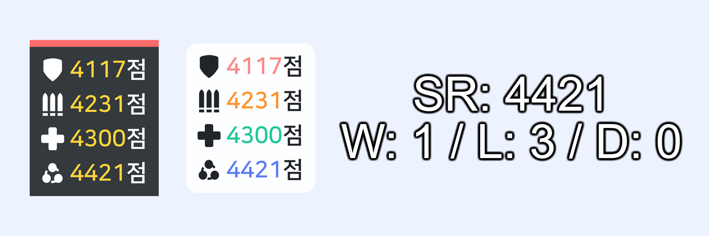

# 오버워치 레이아웃 for NodeCG
[NodeCG](https://github.com/nodecg/nodecg)로 이용해서 여러분의 방송 화면을 깔끔하고 더욱 유동적이게 만들어주는 레이아웃 입니다.

## 기능
* 오버워치 점수 표시 오버레이
  * 기본 스킨
  * mL7 스타일 스킨
  
## 설치 방법
해당 내용은 오버워치 레이아웃 설치 방법이며, NodeCG 설치 방법은 [이쪽](https://www.nodecg.dev/docs/installing)에서 확인해 주시기 바랍니다.

### 간단 설치
Releases 페이지 들어가서 `overwatch-layout.zip` 파일을 다운로드 해 주고, `nodecg/bundles` 폴더에 압축 풀어주시면 레이아웃 설치 성공입니다.

### 명령어 활용
명령어로도 간단하게 설치 할 수 있습니다
```
cd nodecg/bundles
git clone --branch https://github.com/haruchanheart/overwatch-layout.git
```

## 사용 방법
### 방송 화면에 추가
NodeCG 접속 후 Graphics 메뉴에서 링크를 복사합니다. 그리고 OBS에서 브라우저를 추가해 링크를 붙여넣어서 적용시키면 됩니다.

### 오버워치 점수 표시 오버레이

Graphics 메뉴로 가면 `overwatch.html` 그리고 `overwatch_ml7.html`을 볼 수 있는데. 점수 표시 스타일이 각각 다른 기능을 가지고 있습니다.

`overwatch.html`은 기본 스킨이며 **돌격군, 공격군, 지원군과 자유 경쟁전 점수**를 한번에 보여줄 수 있게 해 주거나 순서대로 표시해 줄수 있습니다. **대신 전적은 표시할 수 없습니다.**

`overwatch_ml7.html`은 [mL7](https://twitch.tv/ml7support) 님의 방송에 쓰이는 점수 표시 스타일이며 **경쟁전 플레이 전적**을 표시할 수 있습니다. 단, 점수는 **자유 경쟁전 점수**만 쓰입니다.

이제 Workspace 메뉴로 들어가면 오버워치 점수 패널이란 창을 볼 수 있고 여기서 각각 내용에 맞게 수정해 주시면 됩니다.

## 사용된 라이브러리
* Materialize CSS
* anime.js 애니메이션 라이브러리
* jQuery 라이브러리